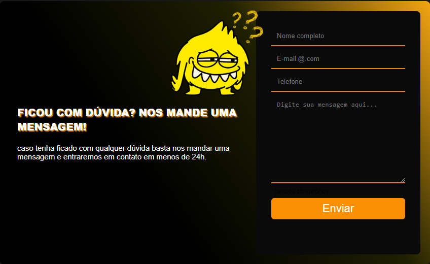
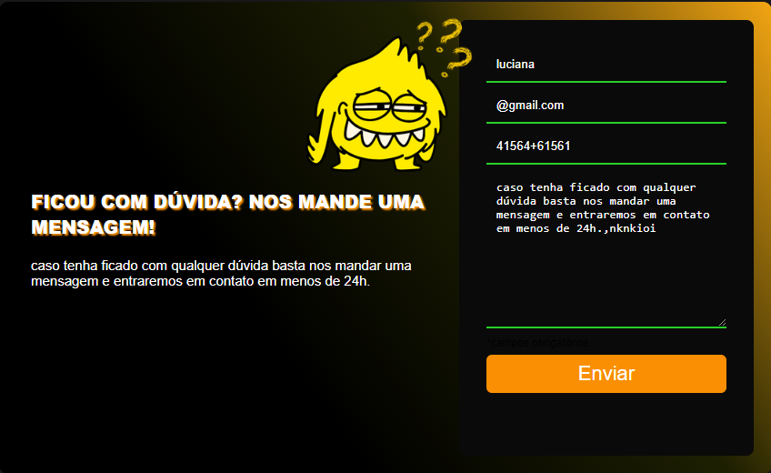
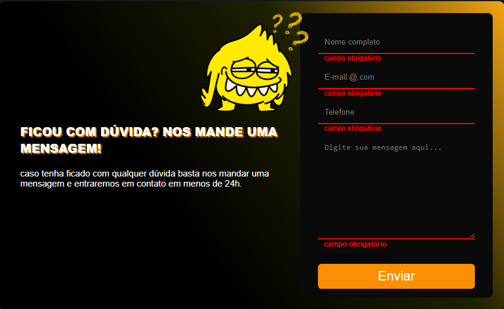
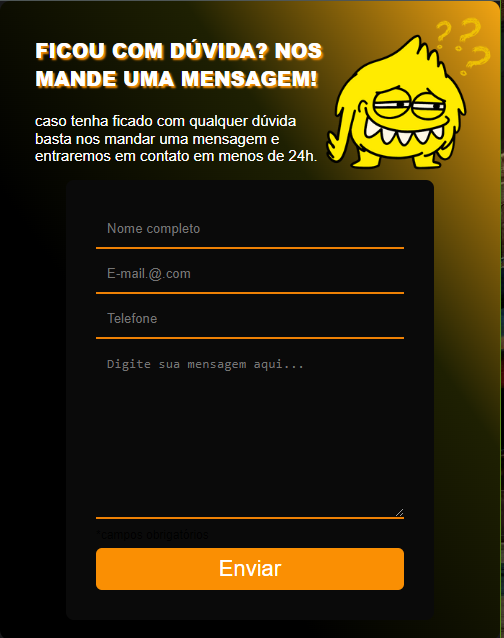

## # Formulário de contato com validação 
<a href=" https://luvalentinaa.github.io/form-validation/">Acesse no Github Pages 🔗</a>

   

  
    
  
  

- # Desafio
- Construir um formulário de contato com validação.
- 

  - # Construído com
- Marcação HTML5 semântica
- Propriedades personalizadas de CSS
- Flexbox
- Grade CSS

